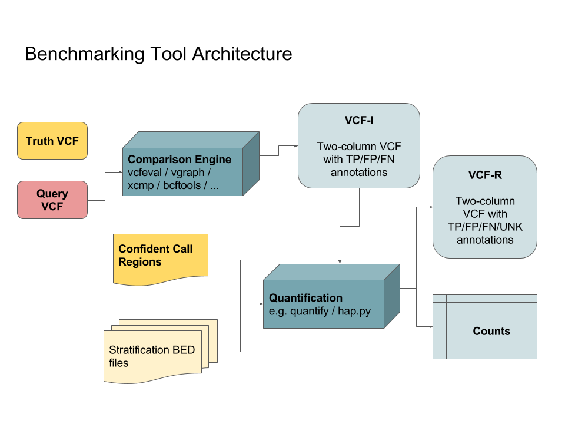

Benchmarking Reference Implementation
=====================================

Here we define input, intermediate and output formats for the benchmarking
reference implementation.

The goal of this reference implementation is to

* support different benchmark types
* allow adding  new comparison types
* counts consistently and accurately for different truth sets
* support common truth datasets
* allow anyone to contribute

The following image outlines the basic infrastructure:

Generic File Formats
--------------------

All file formats are based on common standards in genomics:

* *VCF*: [https://samtools.github.io/hts-specs/VCFv4.2.pdf](https://samtools.github.io/hts-specs/VCFv4.2.pdf)
* *BED*: [https://genome.ucsc.edu/FAQ/FAQformat.html#format1](https://genome.ucsc.edu/FAQ/FAQformat.html#format1)

Inputs
------

For the description of truth and query formats, see [inputs.md](inputs.md)

Stratification Regions
----------------------

The format for stratification regions is defined in
[stratification.md](stratification.md)

Outputs
-------

The output formats are defined in [outputs.md](outputs.md)

Intermediate Outputs
--------------------

Intermediate formats for passing data from the comparison engine to the
counting step are described in [intermediate.md](intermediate.md).
